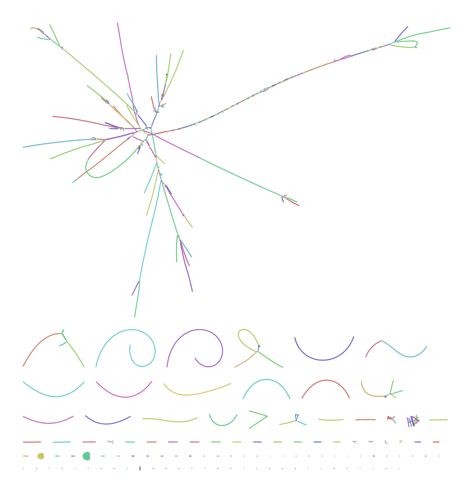
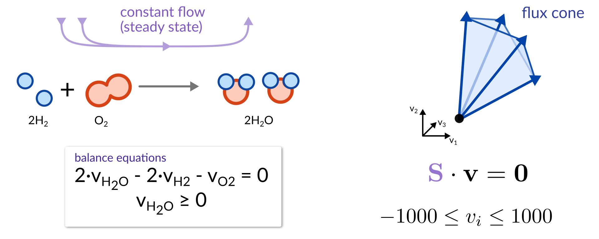
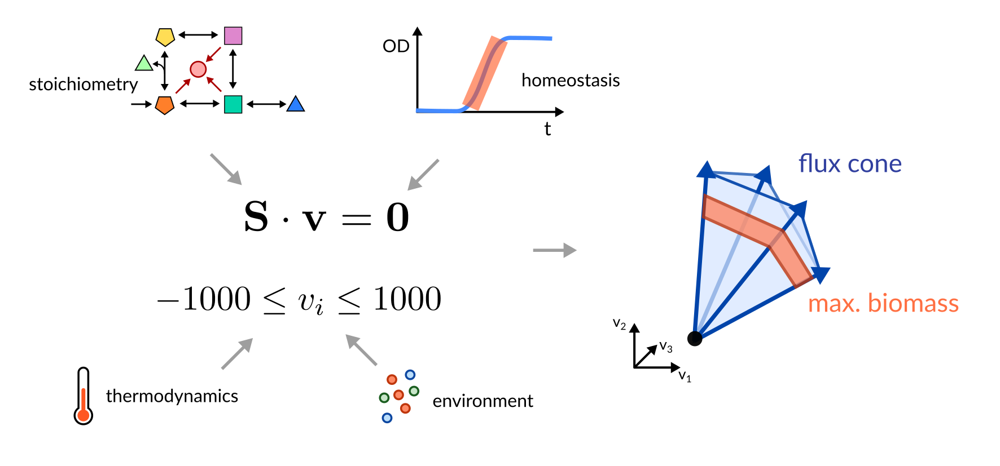
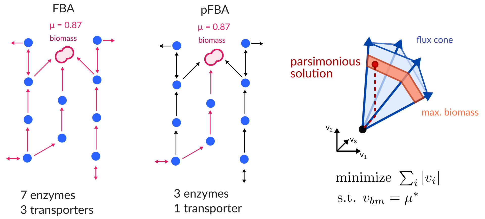

<!-- .slide: data-background="assets/isb/data-midnight.jpg" class="dark" -->

# Metabolic Modeling of Baterial Isolates

### Christian Diener, Gibbons Lab

from the *2021 ISB Virtual Microbiome Series*

 

<a href="https://creativecommons.org/licenses/by-sa/4.0/"><i class="fa fa-bullhorn"></i>CC-BY-SA</a>
<a href="https://gibbons.isbscience.org/"><i class="fa fa-globe"></i>gibbons.isbscience.org</a>
<a href="https://github.com/gibbons-lab"><i class="fa fa-github"></i>gibbons-lab</a>
<a href="https://twitter.com/thaasophobia"><i class="fa fa-twitter"></i>@thaasophobia </a>

---

<!-- .slide: data-background="var(--primary)" class="dark" -->

Let's get the slides first (use your computer, phone, TV, fridge)

*https://gibbons-lab.github.io/isb_course_2021/models*

---

<!-- .slide: data-background="var(--primary)" class="dark" -->

## Quick reminder :clock:

 

---

# Functional analyses

Tries to predict what the microbiome *does* from sequencing data.

Uses gene/transcript/protein/metabolite abundances (metagenomics, metatranscriptomics, proteomics or metabolomics).

Gene content yields metabolic *capacity* or *potential*.

---

<!-- .slide: data-background="var(--secondary)" class="dark" -->

# Genes and metabolite abundances are cool but not what you really care about*

hot take :fire:

---

## Fluxes

<video width="45%" autoplay loop>
  <source src="assets/fluxes.mp4" type="video/mp4">
</video>

video courtesy of [S. Nayyak](https://twitter.com/Na_y_ak) and [J. Iwasa](https://twitter.com/janetiwasa)

---

<!-- .slide: data-background="var(--secondary)" class="dark" -->

# How do we get from sequencing data to metabolic reactions?

Metabolic reactions are catalyzed by an organism's *enzymes* which are encoded
in its *genes*.

---

## Genome Assembly

---

## Not so straight-forward

---

## Finding genes

---

<!-- .slide: data-background="var(--secondary)" class="dark" -->

# Flux Balance Analysis (FBA)

Can we infer the most likely fluxes in a biological system if we know all
available metabolic reactions?

---

## The flux cone

---

The goal of FBA is to *reduce* the flux space to a *biologically relevant* one.

---

## Genome-scale metabolic modeling

---

## Selecting biologically relevant fluxes via parsimony

Reproduces experimental fluxes in <i>E. coli</i> [very well](https://dx.doi.org/10.1038%2Fmsb.2010.47).

Bacteria do not like to produce more enzymes than necessary.

---

<!-- .slide: data-background="var(--primary)" class="dark" -->

---

## Your turn

---

<!-- .slide: data-background="var(--primary)" class="dark" -->

## Challenge placeholder &#129440;

---

<!-- .slide: data-background="assets/isb/microbes-azure.jpg" class="dark" -->

### And we are done :clap:

*ISB team*  
Joey Petosa  
Allison Kudla  
Sean Gibbons  
Priyanka Baloni  
Tomasz Wilmanski  
Noa Rappaport  
Alex Carr

# Thanks!

