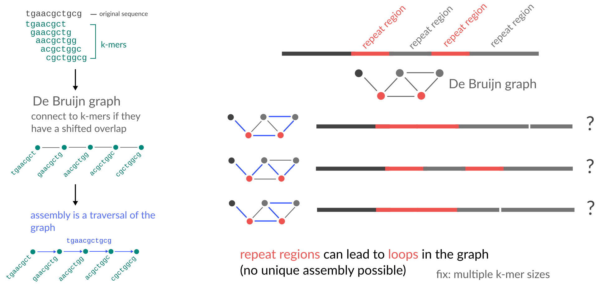
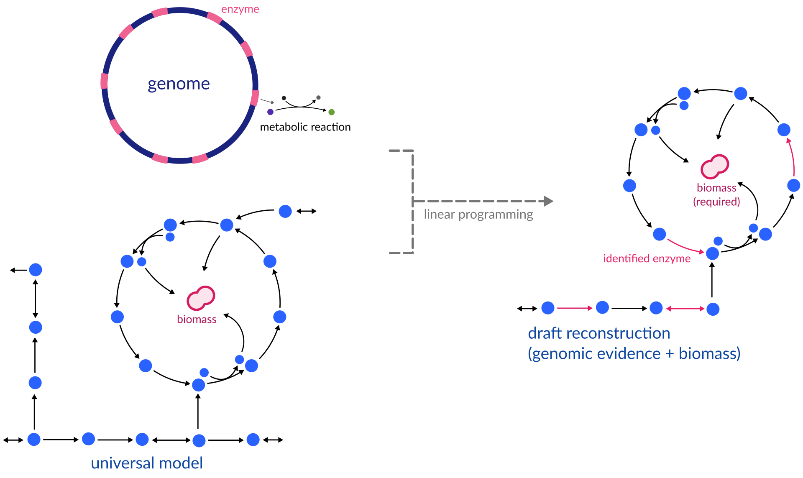

<!-- .slide: data-background="assets/isb/data-midnight.jpg" class="dark" -->

# Building metabolic models of bacterial isolates

### Christian Diener, Gibbons Lab

from the *2021 ISB Virtual Microbiome Series*

 

<a href="https://creativecommons.org/licenses/by-sa/4.0/"><i class="fa fa-bullhorn"></i>CC-BY-SA</a>
<a href="https://gibbons.isbscience.org/"><i class="fa fa-globe"></i>gibbons.isbscience.org</a>
<a href="https://github.com/gibbons-lab"><i class="fa fa-github"></i>gibbons-lab</a>
<a href="https://twitter.com/thaasophobia"><i class="fa fa-twitter"></i>@thaasophobia </a>

---

<!-- .slide: data-background="var(--primary)" class="dark" -->

Let's get the slides first (use your computer, phone, TV, fridge)

*https://gibbons-lab.github.io/isb_course_2021/models*

---

<!-- .slide: data-background="var(--primary)" class="dark" -->

## Quick reminder :clock:

 

---

# Functional analyses

Tries to predict what the microbiome *does* from sequencing data.

Uses gene/transcript/protein/metabolite abundances (metagenomics, metatranscriptomics, proteomics or metabolomics).

Gene content yields metabolic *capacity* or *potential*.

---

<!-- .slide: data-background="var(--secondary)" class="dark" -->

# Genes and metabolite abundances are cool but not what you really care about*

hot take :fire:

---

## Fluxes

<video width="45%" autoplay loop>
  <source src="assets/fluxes.mp4" type="video/mp4">
</video>

video courtesy of [S. Nayyak](https://twitter.com/Na_y_ak) and [J. Iwasa](https://twitter.com/janetiwasa)

---

<!-- .slide: data-background="var(--secondary)" class="dark" -->

# Flux Balance Analysis (FBA)

Can we infer the most likely fluxes in a biological system if we know all
available metabolic reactions?

---

## The flux cone

---

The goal of FBA is to *reduce* the flux space to a *biologically relevant* one.

---

## Genome-scale metabolic modeling

---

<!-- .slide: data-background="var(--secondary)" class="dark" -->

# How do we get from sequencing data to metabolic reactions?

Metabolic reactions are catalyzed by an organism's *enzymes* which are encoded
in its *genes*.

So what we need is a *genome*.

---

## Genome Assembly with De Bruijn graphs

---

## Not so straight-forward

---

## Finding genes

- finds open reading frames (ORFs)
- identifies ribosomal binding sites and spacers
- *really good* at identifying proteins

https://github.com/hyattpd/Prodigal

---

---

<!-- .slide: data-background="var(--secondary)" class="dark" -->

# Genome-scale Metabolic Model Reconstruction

Mapping to reference databases we will only ever identify a small set (~1/3) of all enzymes and transporters in a genome.

We need to fill in the gaps in metabolic pathways by posing *functional objectives* for the model.

What is the basic objective for a living bacterium?

---

## General strategy

---

---

## Curated reconstructions

*Curation* is the process of adding or removing reactions to the model based on experimental evidence.

 

#### Basic

- structural quality ([MEMOTE](https://doi.org/10.1038/s41587-020-0446-y))
- gap-filling for a standard growth medium (LB, M9, ...)
- example: [carveME EMBL GEMs](https://github.com/cdanielmachado/embl_gems) - 5587 strains

  

#### Stringent

- growth on various carbon sources ("likes maltose but not glucose")
- known metabolic conversion ("produces indole from tryptophan")
- strain-specific biomass composition
- example: [AGORA](https://www.vmh.life/#microbes/) - 818 strains from human gut

---

|                | [carveME](https://doi.org/10.1093/nar/gky537) | [ModelSEED/Kbase](https://doi.org/10.1038/nbt.1672) | [gapseq](https://doi.org/10.1186/s13059-021-02295-1) |
|----------------|-----------|-----------------|------------|
| speed          | :smile:   | :pensive:       | :cry:      |
| sensitivity    | :pensive: | :cry:           | :smile:    |
| model quality  | :smile:   | :pensive:       | :smile:    |
| free solver    | :cry:     | :pensive:       | :smile:    |
| easy install   | :smile:   | :smile:         | :cry:      |
| easy to use    | :pensive: | :smile:         | :cry:      |
| many media     | :pensive: | :smile:         | :smile:*   |
| SBML standard  | :smile:   | :smile:         | :smile:    |

## Limitations

- unknown enzymes/pathways are never captured
- dependency on universal model
- hard to formulate growth media
- growth objective may not always apply (toxicity, human tissues)

---

## Your turn

Let's go from assembly to a genome-scale metabolic model.

---

<!-- .slide: data-background="assets/isb/data-midnight.jpg" class="dark" -->

# Reverse ecology: inferring environmental interactions with metabolic models

### Christian Diener, Gibbons Lab

from the *2021 ISB Virtual Microbiome Series*

 

<a href="https://creativecommons.org/licenses/by-sa/4.0/"><i class="fa fa-bullhorn"></i>CC-BY-SA</a>
<a href="https://gibbons.isbscience.org/"><i class="fa fa-globe"></i>gibbons.isbscience.org</a>
<a href="https://github.com/gibbons-lab"><i class="fa fa-github"></i>gibbons-lab</a>
<a href="https://twitter.com/thaasophobia"><i class="fa fa-twitter"></i>@thaasophobia </a>

---

<!-- .slide: data-background="var(--secondary)" class="dark" -->

# Optimal growth rate ≠ unique fluxes

Even though FBA yields a unique estimate of the maximum growth rate it does not give us a unique flux solution.

Can we constrain the flux space even further?

---

## Selecting biologically relevant fluxes via parsimony

- Bacteria do not like to produce more enzymes than necessary.
- Zero flux = no enzyme required.
- Reproduces experimental fluxes in <i>E. coli</i> [very well](https://dx.doi.org/10.1038%2Fmsb.2010.47).

---

<!-- .slide: data-background="var(--secondary)" class="dark" -->

FBA results strongly depend on the *environmental conditions*. Finding
uptake constraints is *critical* for realistic results.

Quantitative > qualitative >> unconstrained

Uptake and secretion fluxes are much easier to measure than internal fluxes (can use longitudinal metabolomics).

---

## Your turn

Let's get the fluxes for our models.

---

<!-- .slide: data-background="var(--primary)" class="dark" -->

# Reverse ecology

[Ecology](https://en.wikipedia.org/wiki/Ecology) is the study of the relationships between living organisms and their physical environment.

[Reverse Ecology](https://en.wikipedia.org/wiki/Reevrse_ecology) is the study of an organisms ecology based on its genome.

---

## Wait, did we just stumble into Reverse Ecology?

Systems Biology lingo:
>All strains were simulated in the exact same environment but had different *uptake rates* to obtain their *maximum growth rate*.

Ecology lingo:
>We estimated the *realized niche* of bacterial strains under *optimal fitness*.

What does it mean if two strains use similar niches, or very different ones? Thinks about the human gut where many of them may be present at the same time.

---

## Your turn

Let's combine *all* the results.

---

<!-- .slide: data-background="var(--primary)" class="dark" -->

## Challenge placeholder &#129440;

---

<!-- .slide: data-background="assets/isb/microbes-azure.jpg" class="dark" -->

### And we are done :clap:

*ISB team*  
Joey Petosa  
Allison Kudla  
Sean Gibbons  
Priyanka Baloni  
Tomasz Wilmanski  
Noa Rappaport  
Alex Carr

# Thanks!

